# Boolean Arithmetic and the ALU

## Binary Addition

Half Adder

| a| Description |
| ----------- | ----------- |
| Header      | Title       |
| Paragraph   | Text        |

|a|b|sum|carry|
|-|-|--|---|
|0|0|0|0|
|0|1|1|0|
|1|0|1|0|
|1|1|0|1|

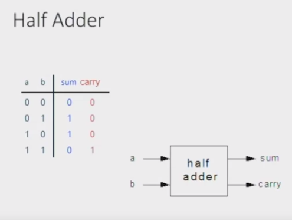

Now suppose that we actually have a carry:

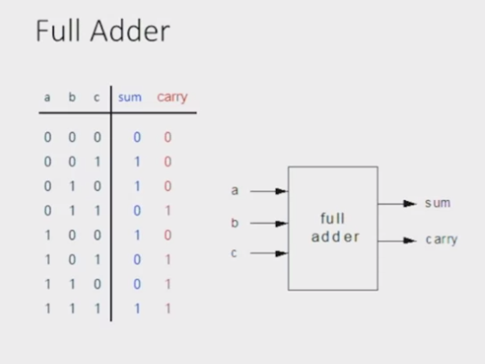

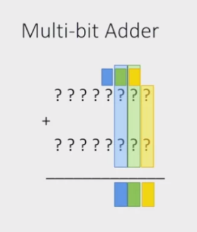

## Negative Numbers

Usually the accepted approach is to use 2's complement. Represent Negative number -x using the positive number: $2^n -X$ 

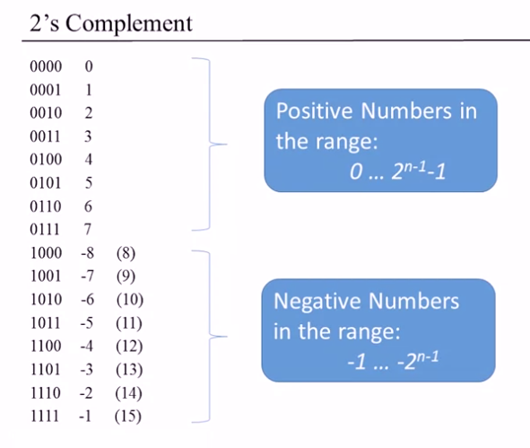

### 2's Complement
- Positive Numbers in the range: 0 ... $2^{n-1}-1$
- Negative Numbers in the range: -1 ... $-2^{n-1}$

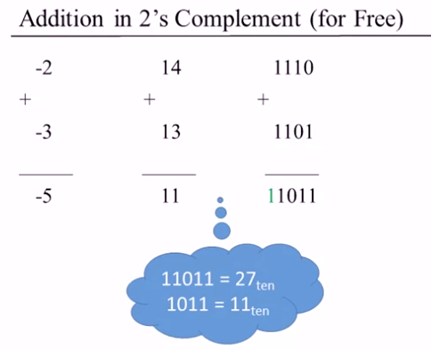

If we wouldn't discard the most important bit (the one in green), the result would be $27_{ten}$

So for example, 7 is 0111, $-5$ is 1011 so $7 + (-5) = 2$

**How do you calculate -x**

$$2^n - x = 1 + (2^n - 1 ) - x$$

But, $2^n - 1 = 11111111_{two}$ So: 

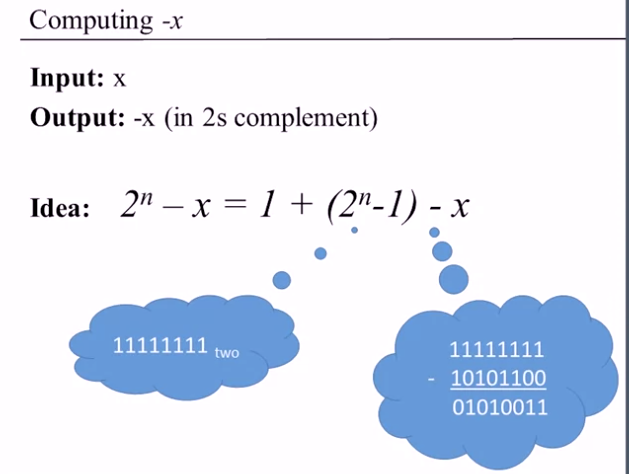

You just need to flip any one of the bits. So, for example, take 4 and we want to produce -4:
So $2^n - x= 16 - 4 = 12$ which on our case is -4.

So you need to get to 12 in decimal.

A tip in case you need to add 1:
Flip the bits from right to left, stopping in the first time 0 is flipped to 1.

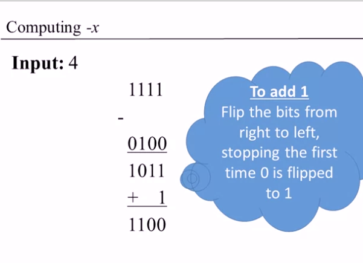

## Arithmetic Logic Unit

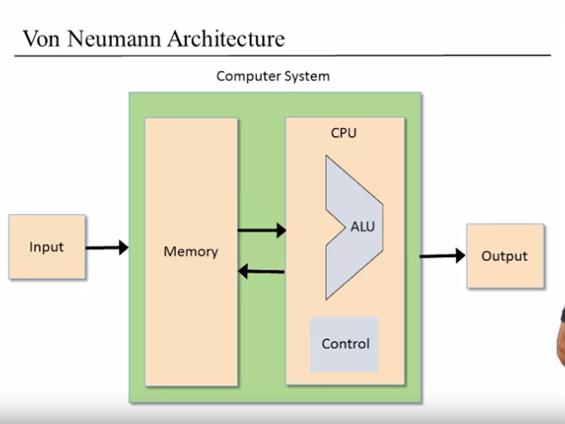

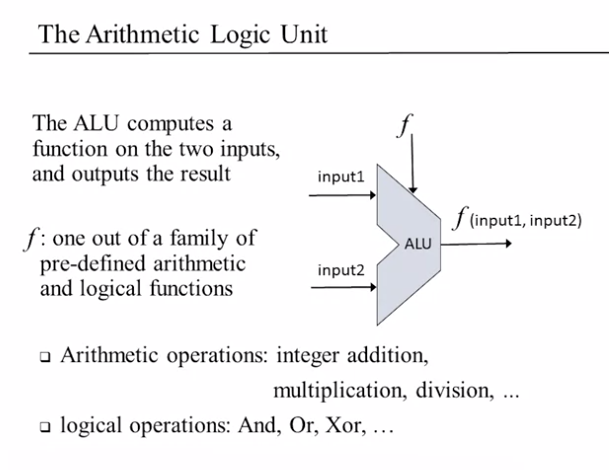

When you build an ALU, how much functionality you want to build in this device. This is the typical hardware / software tradeoff. If you didn't build it in hardware, later you should complete it in software.

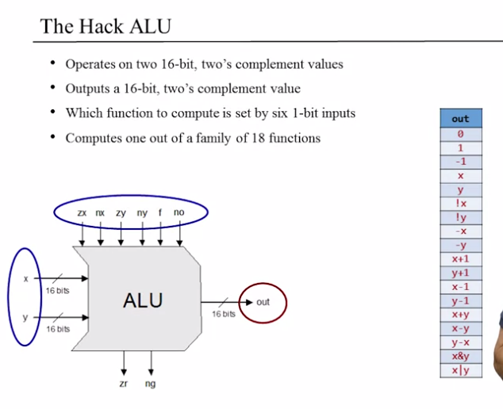

In the hack ALU, which function to compute is based on 6 1-bit inputs. The functions are the following:

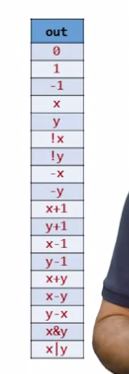

HACK ALU also  outputs two 1-bit values (zr and ng).

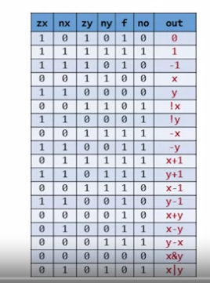

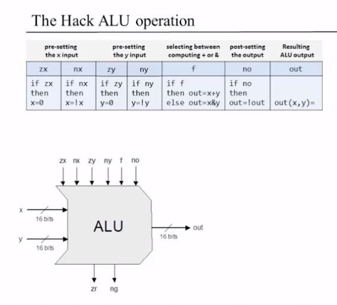

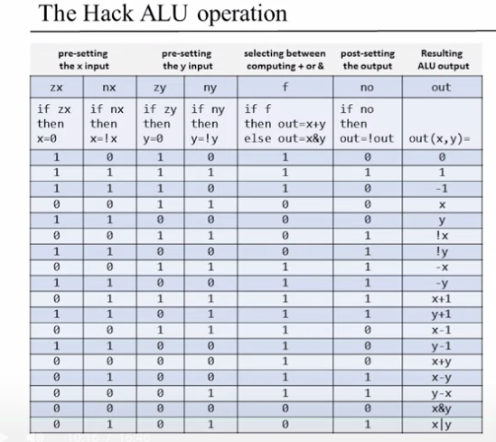

The role of the output controlling bits (zr + ng) is to say something about the main output.

if out == 0 then zr = 1, else zr = 0
if out is negative, then ng = 1, else ng = 0

## Project

**Implementation tips for 16-bit adder**:
- An n-bit adder can be built from *n* full-adder chips
- The carry bit is "pipped" from right to left
- The MSB carry bit is ignored

**Implementation tips for ALU**:
- Building blocks are Add16 and various chips from project 01.
- Can be build with less than 20 lines of HDL code. 

