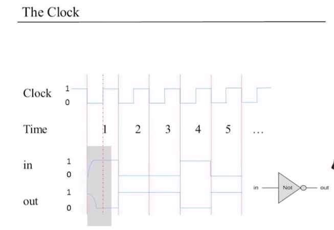
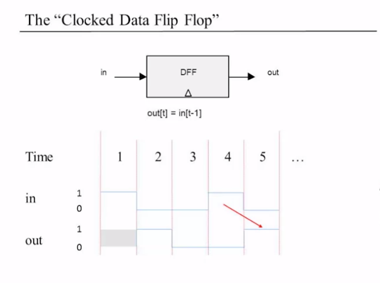
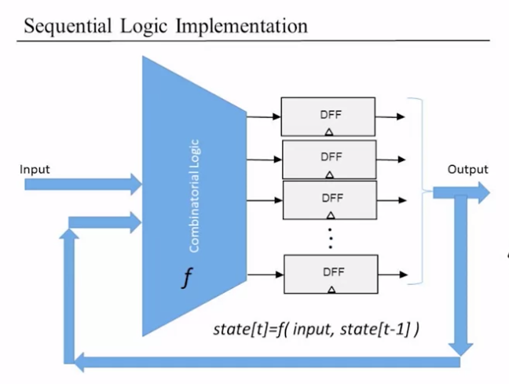
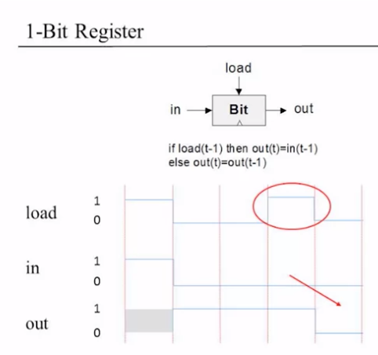
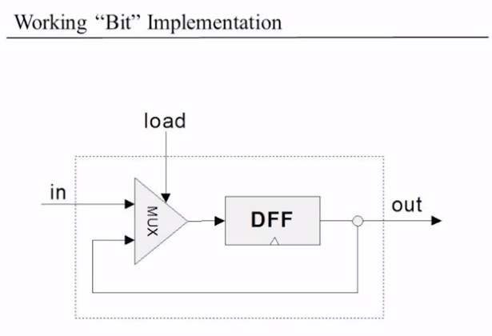
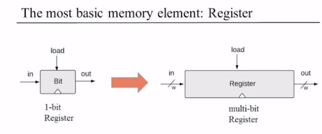
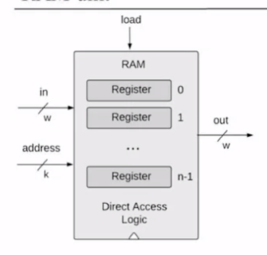
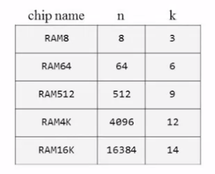

# Memory

## Sequential Logic

For now we haven't take into account the concept of time in computers.

Computers work in some finite speed and you need no make sure that you don't ask the computer to perform computation faster than it can.

Whatever happens before the gray area we don't need to think about it, because we know it's gone by the end of the clock cycle.

We use discrete time steps instead of continuous time to ensure the system state is stabilized.

## Flip Flops

Remembering State

- Missing ingredient: remember one bit of information from time t-1 so it can be used at time t. 
- At the "end of time" t-1, such an ingredient can be at either of two states: "remembering 0" or "remembering 1"
- At the transition point between two consecutive time units, it must have state. It must remember whether is now remembering 0 or is now remembering 1.
- It has to be in two physical states. So it must be able to move between this two states. (it has to flip between the two).
- Gates that can flip between two states are called Flip-Flops.

The triangle in the diagram represents that we have a sequential chip. A chip that depends on time as opposed to the previous combinatorial chips that we have seen so far which output depends on their own inputs in any given point in time.

Data Flip Flop will also need to access to the clock that converts the continual notion of time into the discrete one.

For example if it's a counter, we are going to remember all this flipflops and the combinatorial logic will basically add 1 to the counter.

## 1-bit register

The differences between DFF chip and the Bit chip is that:
- DFF always stores the "in" bit, while Bit only stores it if "load" is set to 1.
- DFF can store information for one time unit only, while Bit can store it for many cycles.

With this we have built 1-bit memory.

## Memory Units

The RAM is used to store the data and the instructions. 

You can put a bunch of 1-bit registers and then you get an abstraction of a 16-bit. We call it the **register**.

- w (word width): 16-bit, 32-bit, 64-bit (from now on we will talk about 16-bit registers, without loss of generality).
- Register's state: the value which is currently stored inside the register.

To set Register=v, we set in=v and load=1, the register's state becomes y and from the next cycle onward, out emits v.

### RAM Unit

We think about memories as a sequence of n addressable registers, with addresses 0 to n-1.
Irrespective of how many memory units do you have, at any given point of time, only one register in the RAM is selected.  At any point in time we need to check which is the register that we want to read, of the register value we want to change. 

In order to select which register, we use the address. 

If we have to select one out of possible registers, we need $log_2 n$ bits. 8 registers, we need 3 bits. Register 0 = 000, register 7 = 111 and we have all possibilities in the middle. 

The length of the address input, $k=log_2 n$

Width is the amount of data a single register holds, address is the location of the register within a larger chip.

To read Register i: we set address = i. The result is out emits the state of Register i.

To set Register i to v:
set address = i, in=v, load=1.
The state of Register i becomes v, from the next cycle onward, out emits v. 

## Counters

