# Machine language

## Machine Languages: Overview


1. The first thing is what exactly the instruction tells the computer to do. (What are the supported operations?)
2. How do we know which instructions to perform at any given point in time. (How is the program controlled?)
3. We are going to be able to tell the hardware what to operate on. (What do they operate on?)
  - Even if the hardware knows it needs to add two numbers, the software has to tell the hardware where exactly will it get these two values.


## Machine Languages: Elements
From first principles, basically the machine language specifies exactly the kind of thing that the hardware can do for us.


**Machine Operations**
Usually correspond to what's implemented in Hardware
- Arithmetic Operations: add, substract, ...
- Logical Operations: and, or, ...
- Flow control: "goto instruction X"

Differences between machine languages:
- Richness of the set of operations (divisions? bulk copy? ...)
- Data types (width, floating point ...)
Hardware that performs in one operation addition of 64 bit values, is at least 8 times faster than hardware that performs that by a sequence of addition of 8-bit values.


Accessing a memory location is expensive:
- Need to supply a long address
- Getting the memory contents into the CPU takes time

The solution to this is what's called Memory Hierarchy. Each time we go further away from the Arithmetic Unit itself, our memory becomes bigger and accessing it becomes harder but we have more information in there. 

Faster access means smaller memory size.

## Registers

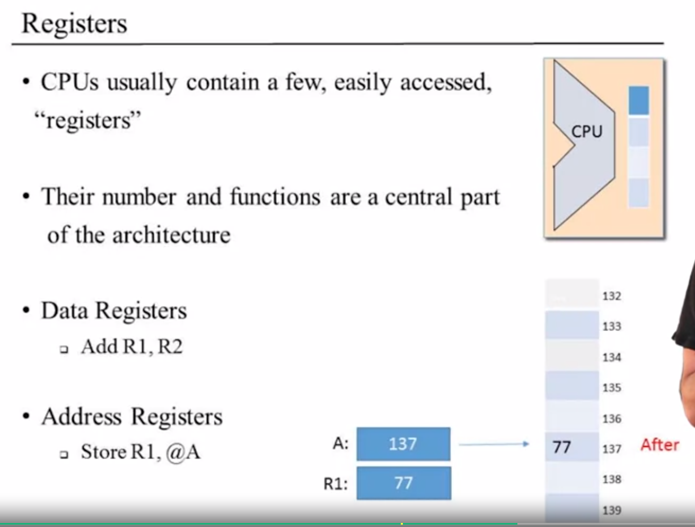


1. The first thing we can do with registers is that we can put data on them and perform operations.
2. The second things is that we can use them as addresses. Store R1, @A when hardware performs this operations, 77 will be written in the main memory. This takes larger amount of time. 


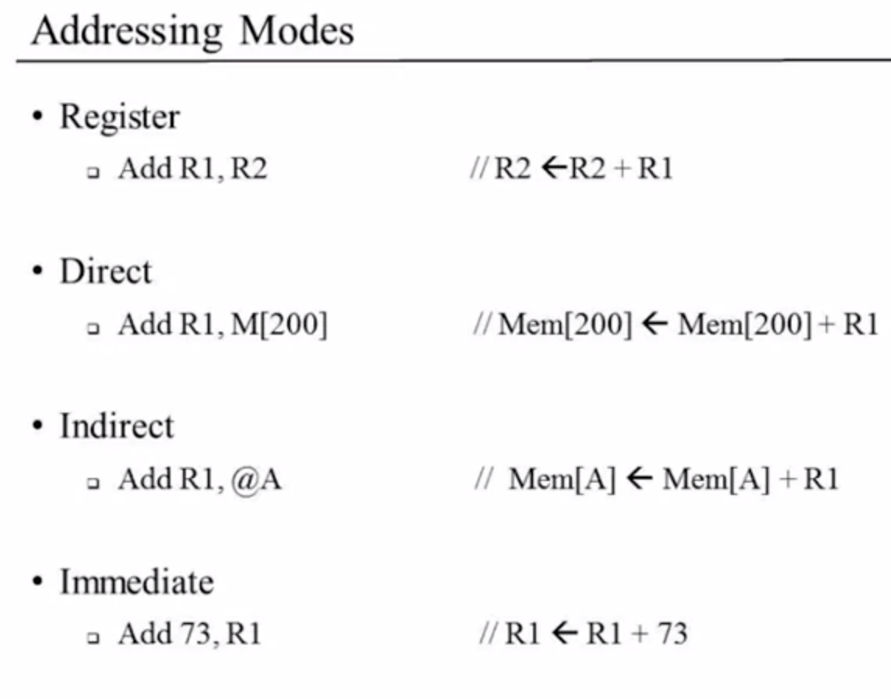

## Flow Control

Usually the CPU executes machine instructions in sequence.
Sometimes we need to "jump" unconditionally to another locations, e.g. so we can loop.
- Sometimes we need to jump only if some condition is met.

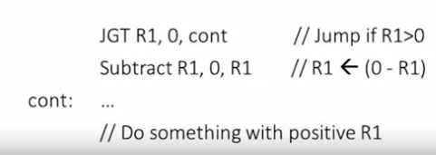

## The Hack Computer and Machine Language

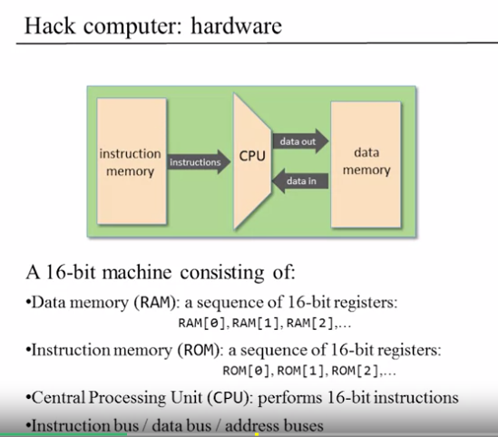

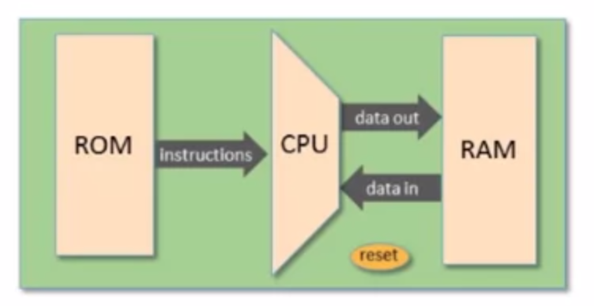

How do we control this computer. We do it with software
The design of the computer is with 2 types of instructions, C and A instructions. A Hack program is the sequence of instructions written in the Hack machine language.

- The D register which holds 16 bit value (that represents data).
- A also holds a 16 bit value or address.
- M represents the 16-bit RAM register addressed by A

### Control
- The ROM is loaded with a Hack program
- The reset button is pushed
- The program starts running


The Hack machine language recognizes three registers:
- D holds a 16-bit value
- A holds a 16-bit value
- M represents the 16-bit RAM register addressed by A


**The A-instruction** (called A for addressing)
- Sets the A register to value
- Side effect: RAM[A] becomes the selected RAM register

Usage example:
Set RAM[100] to -1: 

@100    / A=100

M=-1    / RAM[100]=-1


**RAM**
- Read-write data memory
- Addressed by the `A` register
- The selected register, `RAM[A]` is represented by the symbol M.

**ROM**
- Read-only instruction memory
- Addressed by the same `A` register.
- The selected register, `ROM[A]` contains the "current instruction"

A = 19

Side effects:
- `RAM[A]` called M becomes selected.
- `ROM[A]` becomes selected

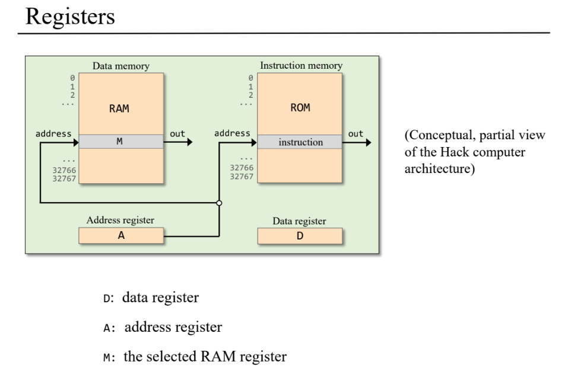

We have an unconditional jump: `0; JMP`

So, from 

```
@1
M=A-1;JEQ
```
- We know that Register `A` has the value 1.
- The value of the `A` register is 1, so the assignment in the second line assigns `A-1` (which equals 0) to `RAM[1]`
- The JEQ jump directive is activated, so the next instruction will be the value stored in A


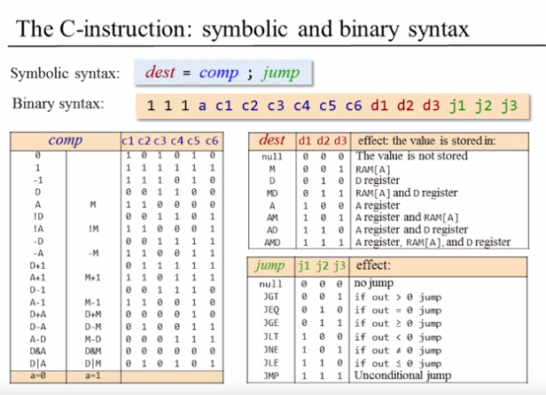


## Input / Output

We represent the pixels with bits. If there are 131,056 pixels, we would need 8191 x 16-bit words. 

When we access memory, we can only retrieve 16 bits in one chunk, we cannot retrieve single bits. 

### Screen

Row 0 is from 0 to 31 because 512 / 16 is 32


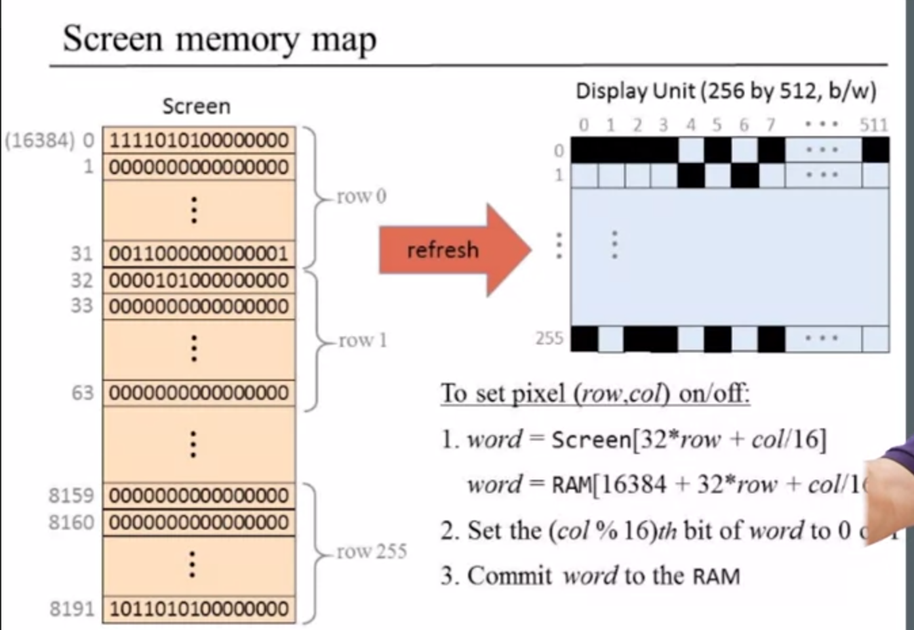

The base address of the Screen is 16384. So, you need 8191. You get 16384+8191=24575


Example:
You want to change the bit in row 4, column 55, what address should you retrieve, and which bit should you change?
- Screen[131], 7th bit.


### Keyboard
- In the Hack computer: probe the contents of RAM[24576]

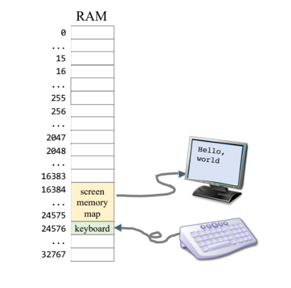


## Hack Programming

### Hack assembly instructions


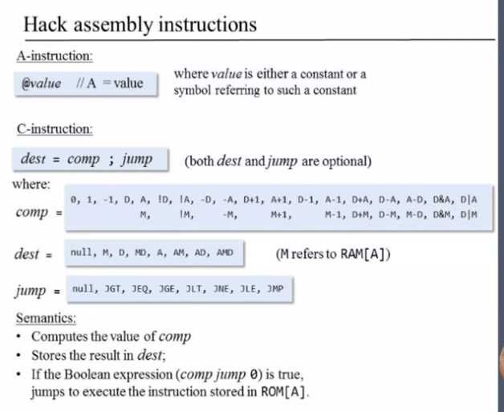

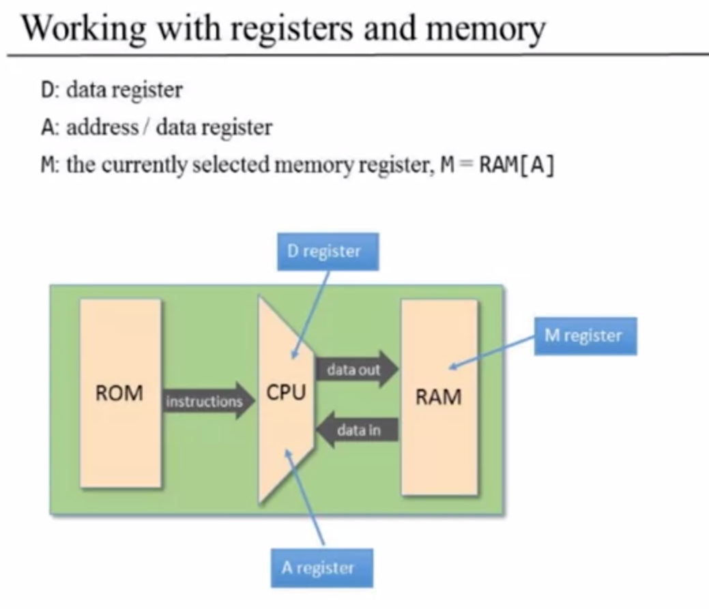

Typical operations:
```
// D=10
@10
D=A


// D++
D=D+1

// D=RAM[17]
@17
D=M

// RAM[17]=0
@17
M=0


// RAM[17]=10
@10
D=A
@17
M=D


// RAM[5] = RAM[3]
@3
D=M
@5
M=D
```


We use Built-in symbols to solve the fact that A register could be used as a Data Register or as a Address Register. 


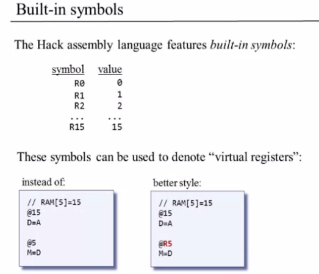


So, whenever we want to address one of the first 16 registers in the memory, use the label convention to denote what you want to do.

## Branching


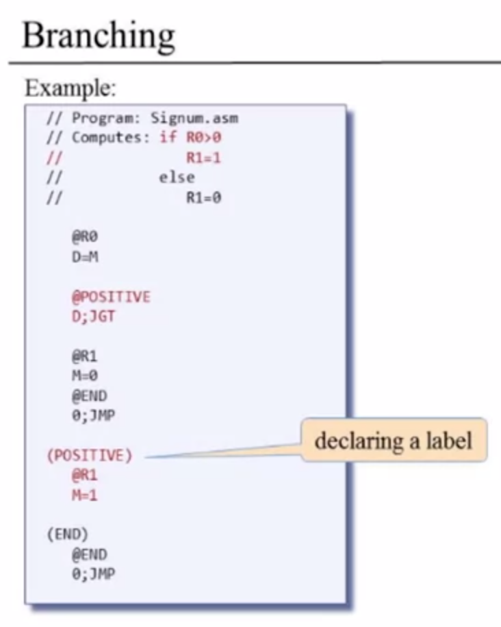


## Variables

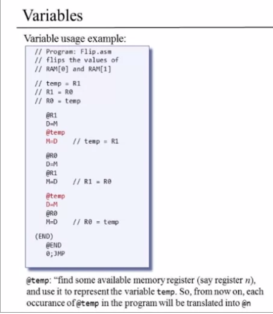

Variables are in lower case and start from 16th register in the memory.


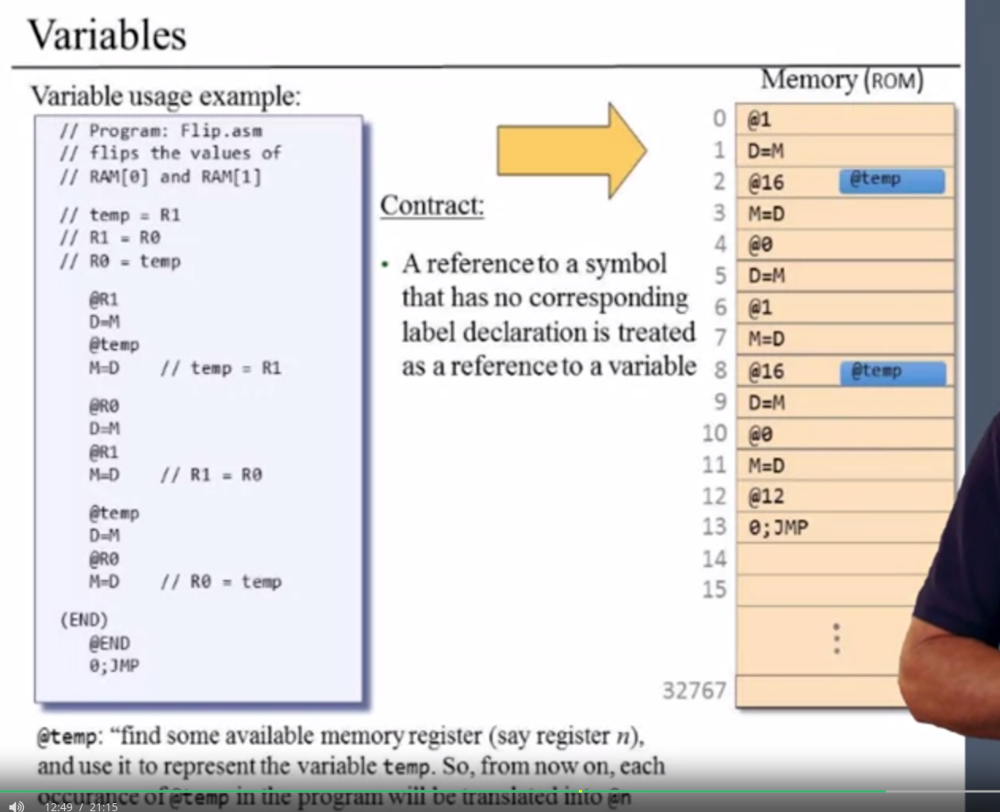


## Iterators

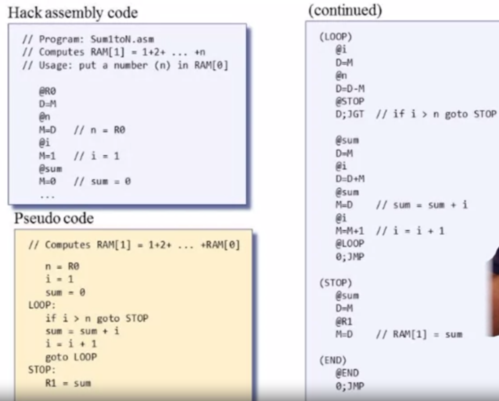


## Pointers


An array is basically a representation of memory. We just need the base address and the length.


**In our example, is very important to note that we assummed that arr has been already initialized before.**

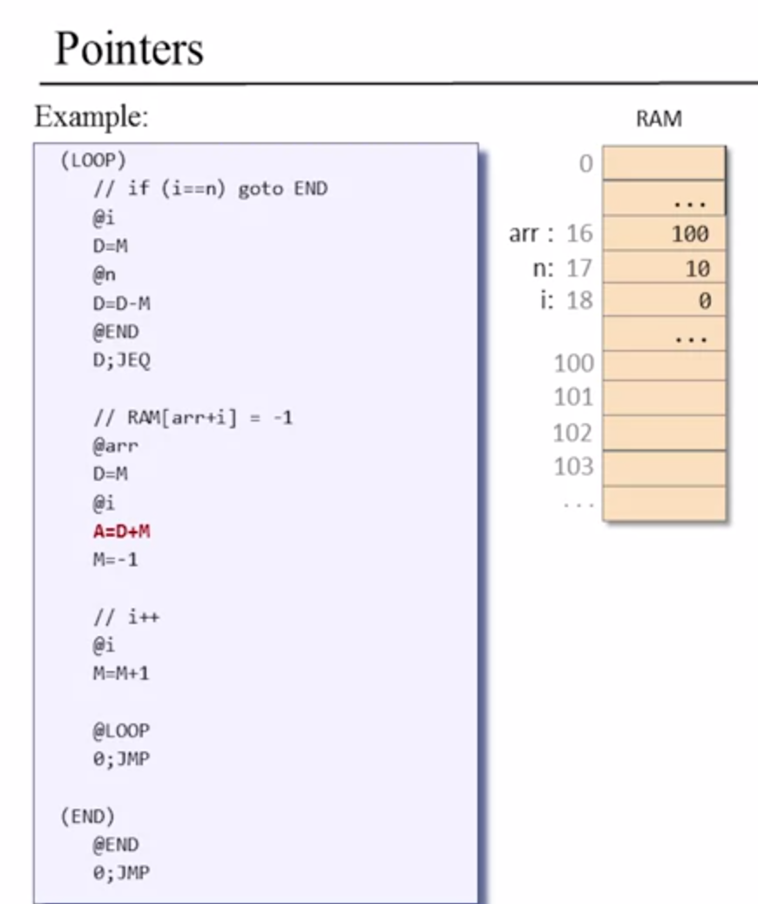


`D+M` stores an address and the address is assigned to A and by the time you state A=-1, the register that will be affected is the register that A addresses.

- Variables that store memory addresses, like `arr` and `i` are called pointers.
- Whenever we have to access memory using a pointer, we need an instruction like `A=M`
- Typical pointer semantics: "set the address register to the value retrieved from memory."


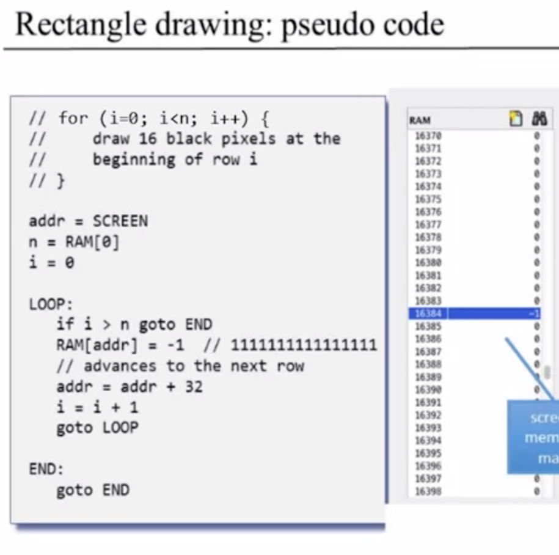

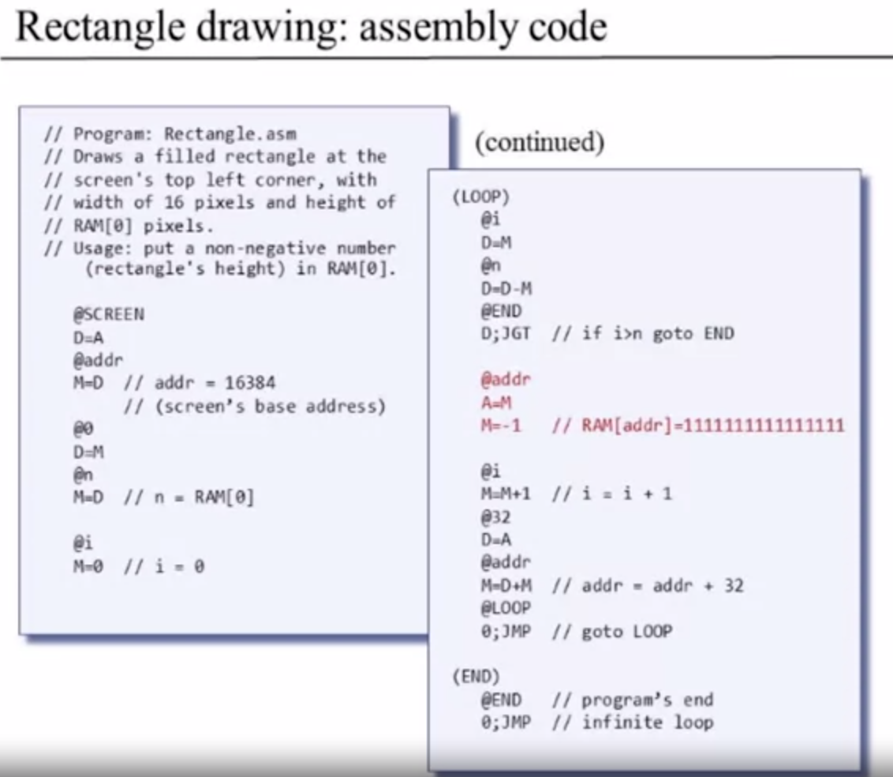


## Overview

Tips for projects:
- For mult you need a loop, addition and subtraction.
- For the fill,  there's a infinite loop that listen to the keyboard and acts accordingly. The other thing is to blacken and make the screen white. 
  - You can use a loop and work with pointer to get the pixels. 


