Computer Architechture

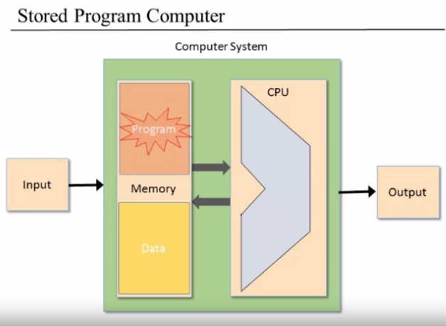

Generally speaking, our CPU is going to be compose of 2 main elements:

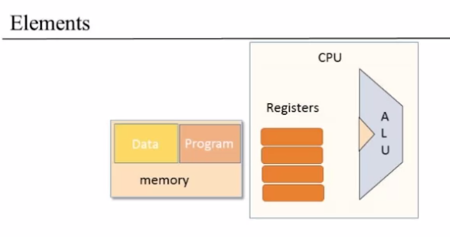

1. Arithmentic Logic Unit (ALU). 
2. Registers: places where we can store data that we are going to use in a bunch of computations.

The information flows is as follows:

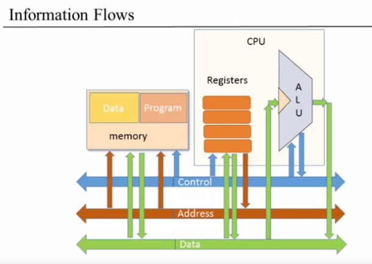

The simpler one is the ALU. The ALU loads information from the Data bus and manipulates it using the Control bits.

There actually needs to be a bunch of wires that actually tells the system what we do at a particular point, this is the Control.

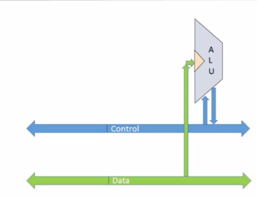

### The Data Registers

1. We store intermediate results into registers so we have to be able to take data from the data bus into the registers, also take data from the registers and feed them back into the data bus.
2. Sometimes, some registers are used to specify addresses. We do this usually by putting numbers (addresses) into a register and then that specifies where we want to access. 

So, registers store data and addresses.

### The memory

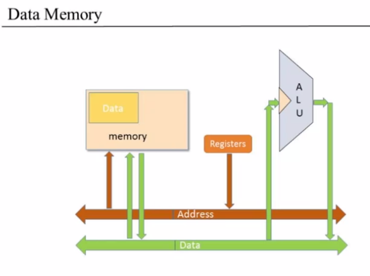

We need to get and address of a data piece that needs to be operated upon. We need read and write into it.

#### The program memory

Looking at the program memory, 

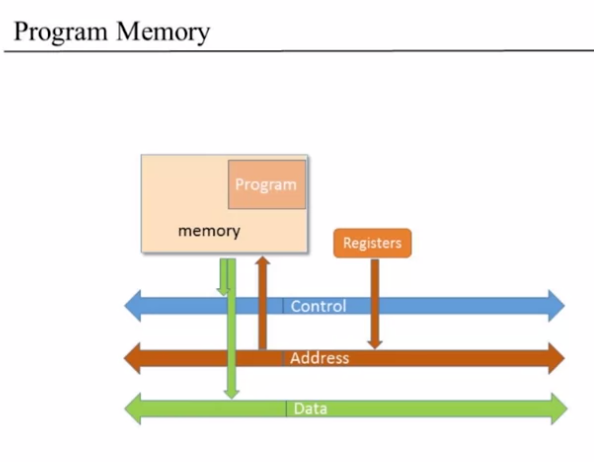

We are going to need to put the address of the next program instruction into the program memory because this is where we're taking our program instructions. We need to be able to put and address into the program memory address and then get the instructions from there. Now, the instructions that we get from the program memory, both may have data in it. 

Another import thing is that the program actually tells the program instruction tells the rest of the system what to do. So we need to be able to actually take information form the next instruction, from the data output of the program memory.

## The Fetch-Execute Cycle

### Fetching
- Put the location of the next instruction into the *address* of the program memory
- Get the instruction code itself by reading the memory contents at that location

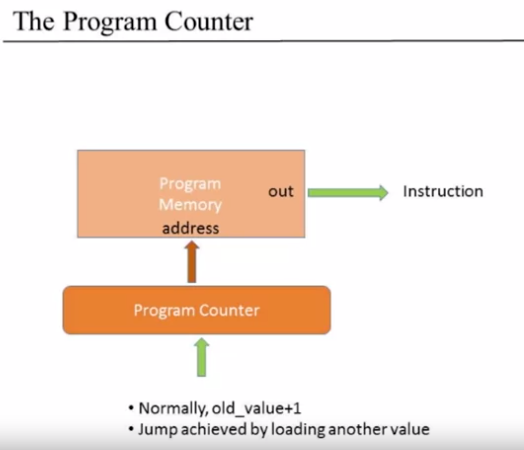

### Executing

- The instruction code specifies "what to do"
  - Which arithmetic or logical instruction
  - What memory to access (read/write)
  - If/where to jump

- Often, different subsets of the bits control different aspects of the operation
- Executing the operation involves also accessing registers and/or data memory

In the fetch cycle, basically we need to get from the program memory, the next instruction. So we need to put into the address of the memory, the address of the next instruction and get the instruction output. On the other hand, in the execute cycle, we need to access data that also resides in memory. So we need to put into the address of the memory, the address of the **data** piece that we want to operate on, which has nothing to do with the program piece that gave us the instruction.

And because we have a single memory, that is a clash because what are we going to put into the address?

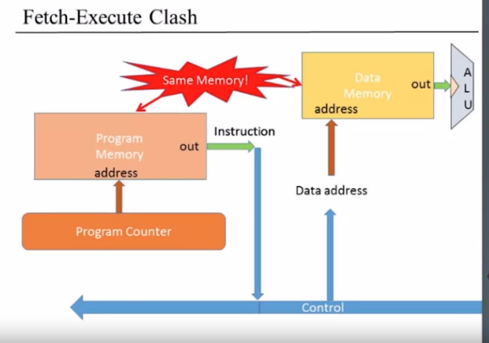

The usual way is to put one after the other with a multiplexer.

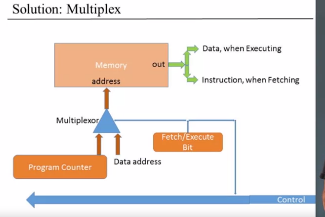

One simple way to do it is to keep the 2 parts separate. That's called the Harvard architecture.

## Central Processing Unit

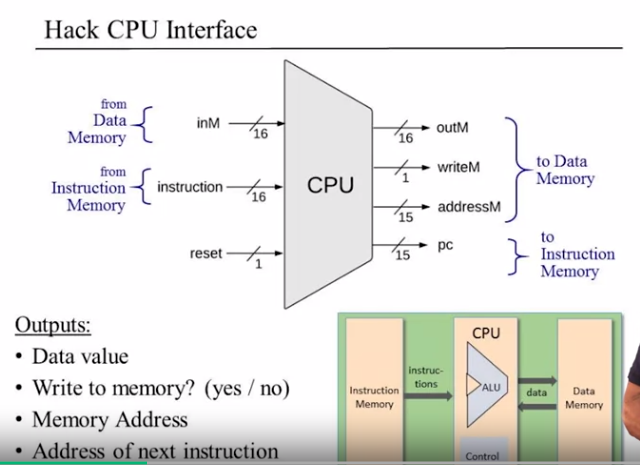

The inputs are the:
i) data value 
ii) the instruction 
iii) the reset bit.

pc holds the address of the next instruction that is going to be fetch and executed.

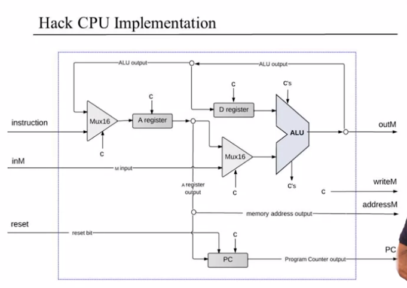

The **c** represents control bits.

Instruction handling for a **A** instruction: 

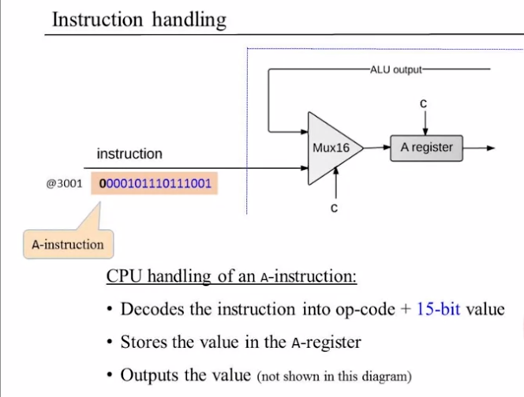

Instruction handling or a **C** instruction:

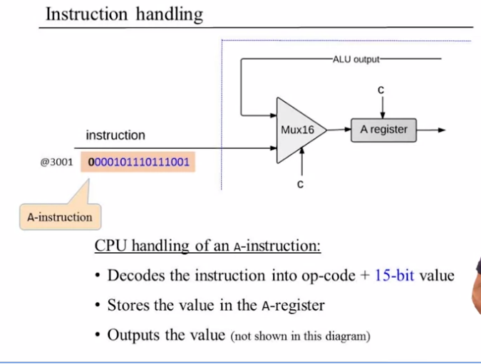

### ALU Operation

The inputs of the ALU comes from two different sources, one of them is the D register, the current value of the D register and the other one is either the value of the A register, or the value of the selected memory register. And there's a mutex that takes care of this decision of where to take the value from.

And the control bit of this mutex, is one of the bits form the instruction.

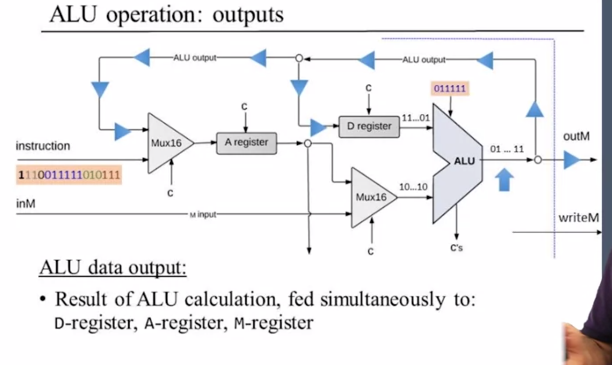

The same ALU in fan out into 3 different places, but we have to decide which door is going to open. We need to use the destination bits:

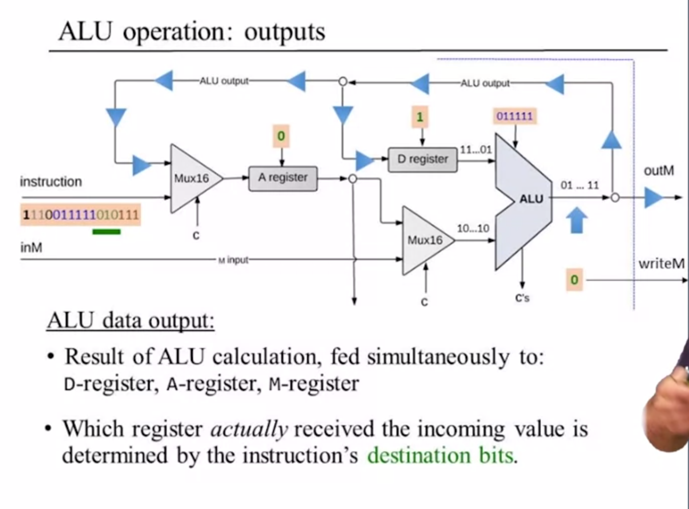

### Control logic 

We want the program counter to always express the next instruction to be executed.

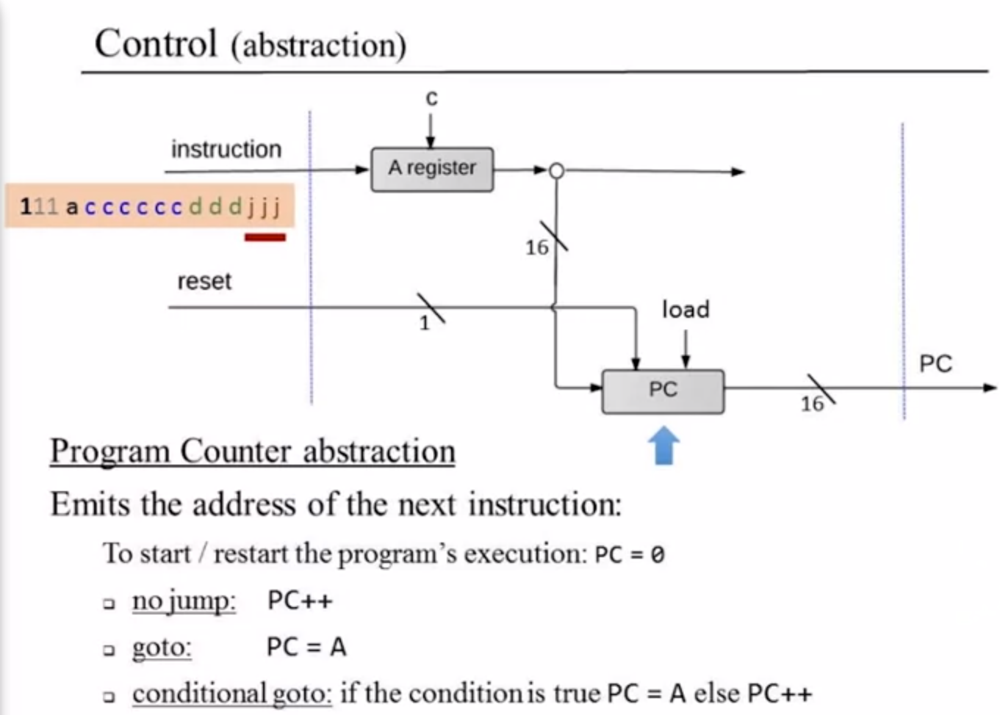

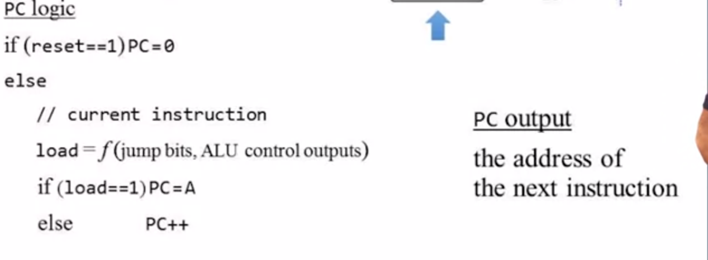

## The Hack Computer

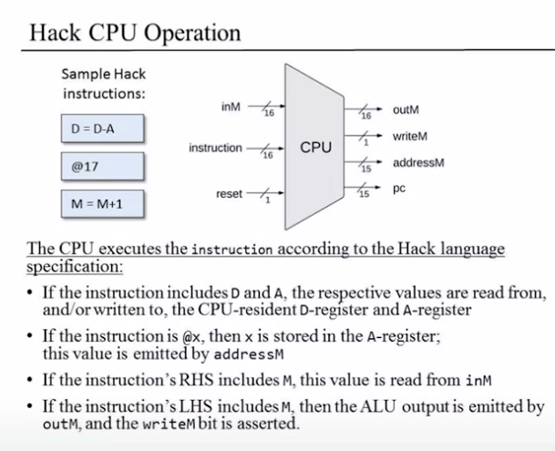

#### Memory

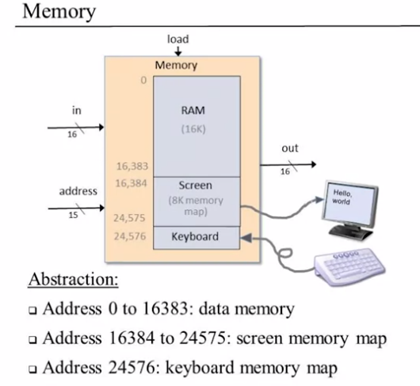

#### ROM interface

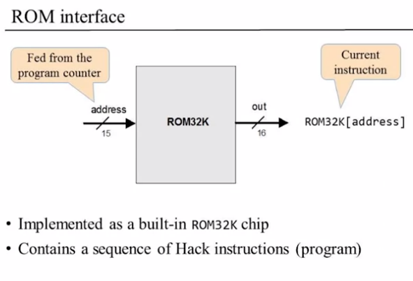

#### Hack Computer Implementation

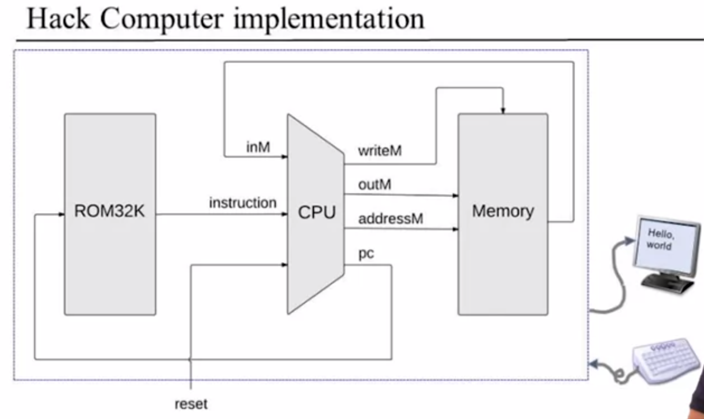

## Overview

The CPU also includes a couple of registers: the **D** and the **A** register.

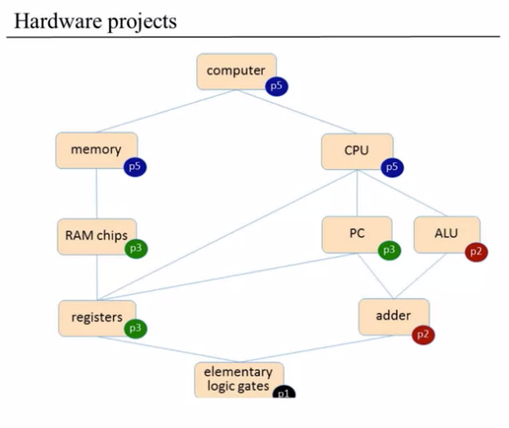

