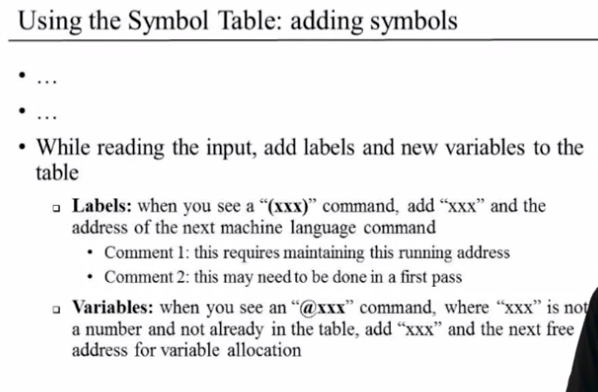

# Assembly Languages and Assemblers

The assembler translates assembly language to machine language.

The assembler enters a symbol into the table only when that symbol has not appeared before.

## The Hack Assembly Language

Assembler for symbol-less Hack programs

- For white space, when you encounter it, you just ignore it.

### Translating A-instructions

If value is a decimal constant, generate the equivalent 15-bit binary constant. 

### Translating C-instructions

We have the set of tables:

Suppose we have `MD=D+1`

The result would be 1110011111011000

## The Assembly Process - Handling Symbols

Symbols:
- **pre-defined symbols** represent special memory locations. Just translate the decimal into binary.
- **label symbols** represent destinations of goto instructions
- **variable symbols** represent memory locations where the programmer wants to maintain values

In the labels, you declared the value of the line of code you see at the left.

The assembler is a two pass assembler process, the first pass we extract all the labels and in the second, you extract all the variables. 

In the first pass, you go through all the program and when you encounter labels (denoted for parenthesis), you declare them as labels. 

In the second pass, you start the entire program, whenever you see a symbol that is not in the symbol table, you know that is variables.

### The assembly process

## Developing a Hack Assembler

